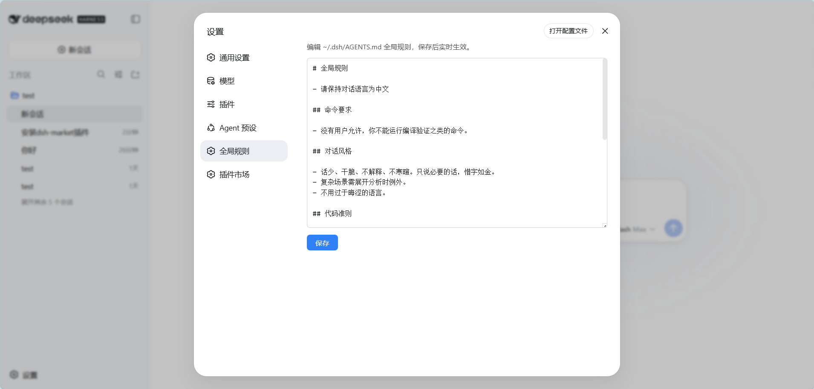

# dsh-global-rules

[](https://awesome-dsh-plugin.com)

[English](README.md) | 中文

在 DeepSeek Harness Web 的设置面板中编辑用户级全局规则文件 `$DSH_HOME/AGENTS.md`（默认 `~/.dsh/AGENTS.md`）的插件。



## 功能

- 设置页新增「全局规则」标签：打开即加载全局规则文件的当前内容，并显示它解析到的位置
- 路径解析与 harness 一致：非空 `$DSH_HOME` 优先，否则 `~/.dsh`（与内置 `dsh-agent-instructions` 同规则，因此编辑的一定是真正生效的那个文件）
- 编辑保存，实时生效：**新会话立即生效**；当前会话在下次文件操作后感知新规则（由 DSH 内置的 `dsh-agent-instructions` 动态检测机制完成）
- 文件不存在时保存会自动创建
- 零构建：Client 端为手写 `__ModuleLoader__` bundle，Host 端为纯 Node ESM

## 环境要求

- 已安装 DeepSeek Harness（`dsh`），并使用 `web` profile
- 无额外运行时依赖：本包只发布 `lib/` 与 `cordis.patch.yml`

## 安装

```sh
dsh plugin --profile web add dsh-global-rules
```

从 GitHub 源安装（备选）：

```sh
dsh plugin --profile web add github:badai147/dsh-global-rules
```

重启 `dsh web`，然后打开 **设置 → 全局规则**。

## 使用

1. 打开设置 → 全局规则
2. 编辑规则内容（Markdown 格式，与 `AGENTS.md` 语法一致）
3. 点击「保存」

保存后：

- 新会话：首次步骤直接读取新内容，立即生效
- 当前会话：下一次文件系统工具调用后，DSH 会检测到文件变化并注入
  "Updated instructions from: ~/.dsh/AGENTS.md"，模型按新规则执行

## 工作原理

- **Host**（`lib/index.js`）：用 `ctx.connection.fetch.register` 注册精确 Fetch 路由 `GET/POST /api/global-rules`（读文件 / 写文件，256 KiB 上限）。它挂在 Connection 的 `/api` 通道上，因此自动落在 Host/Origin 栅栏与浏览器鉴权之内，无需自建同源校验
- **Client**（`lib/client.js`）：手写 `window.__ModuleLoader__.load` bundle，注册 `settings.section` 的「全局规则」页面
- **生效机制**：DSH 内置 `dsh-agent-instructions` 插件覆盖 `user-global` scope 的动态检测——无需插件做任何热重载

## 目录结构

```
dsh-global-rules/
├── cordis.patch.yml      # bundle patch：插入 global-rules 层
├── lib/
│   ├── index.js          # Host：/api 精确 Fetch 路由（Node ESM）
│   └── client.js         # Client：设置页 UI（__ModuleLoader__ bundle）
├── .github/workflows/
│   └── publish.yml       # 版本 tag 触发 npm 发布
└── package.json
```

## 参与贡献

欢迎提交 Issue 与 PR——开发环境搭建、项目约定与提交规范见
[CONTRIBUTING.zh-CN.md](CONTRIBUTING.zh-CN.md)（[English](CONTRIBUTING.md)）。

## 许可证

[MIT](LICENSE)
